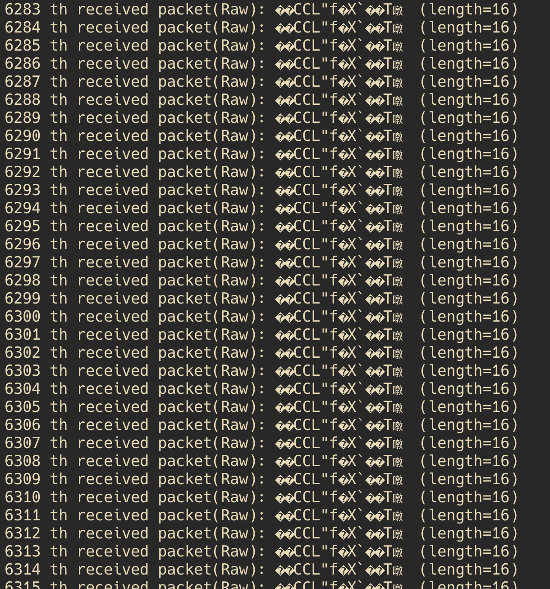
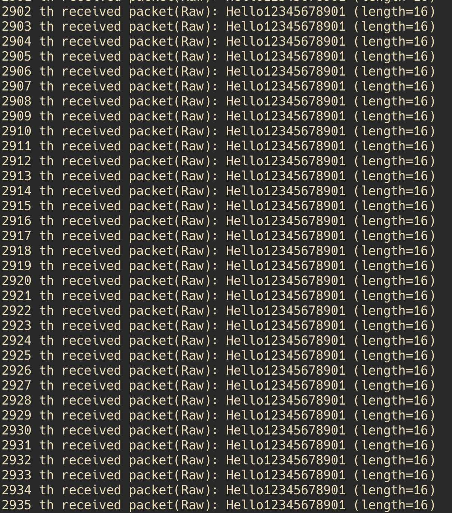

# Project: Validating and Evaluating the Paper, "Implementing AES Encryption on Programmable Switches via Scrambled Lookup"

- **Start the Mininet environment**. On a new terminal, run:
  ```bash
  $ make mininet topo=linear,2,3
  ```

  > **INFO:** The argument `topo=linear,2,3` tells Mininet to start the virtual environment with our example topology, above (i.e., two switches connected linearly with each having three hosts). You can verify this by running the `nodes` command from within the Mininet shell.
  > 
  > ```bash
  > mininet> nodes
  > available nodes are:
  > h1s1 h1s2 h2s1 h2s2 h3s1 h3s2 s1 s2
  > ```

  Notice, that Mininet now runs two switches each listening on their respective GRPC port for Python controller to connect to.
  ``` bash
  *** Starting 2 switches
  s1 ⚡️ stratum_bmv2 @ 50001
  s2 ⚡️ stratum_bmv2 @ 50002
  ```

- ** Install Mininet prerequisites and dependencies. (Make sure Mininet is running in another terminal before executing this command).**.
  ```bash
  $ make mininet-prereqs
  ```

- **Start Python controller for each switch with AES encryption enabled**.
  - Open a new terminal and connect to `s1` on port 50001
    ```bash
    $ make controller name=switch-AES grpc_port=50001 topo=linear,2,3
    ```
  - Open another terminal and connect to `s2` on port 50002 
    ```bash
    $ make controller name=switch-AES grpc_port=50002 topo=linear,2,3
    ```

  > **INFO**:  It takes some time (1-2 min) to run each switch with encryption enabled. Also, make sure to run this "make controller name=switch-AES ..." **one by one**. That means you have to check the first controller successfully starts before start running "make controller" for the other one.


- **For running switches without encryption feature for comparion, start Python controller for each switch as follows**.
  - Open a new terminal and connect to `s1` on port 50001
    ```bash
    $ make controller name=switch-woAES grpc_port=50001 topo=linear,2,3
    ```
  - Open another terminal and connect to `s2` on port 50002 
    ```bash
    $ make controller name=switch-woAES grpc_port=50002 topo=linear,2,3
    ```

  Once running, you should see INFO messages started to print on the terminal. For example, here's a sample output for `s1`:
  ```bash
  Bridge Started @ Port: 50001
  Press CTRL+C to stop ...
  INFO: Log committed to logs/bridge-50001-table.json
  INFO: Log committed to logs/bridge-50001-table.json
  ```

  > **INFO:** 
  > - You can view current entries in the learning bridge table using, e.g., `make controller-logs name=bridge grpc_port=50001`.
  > - You can terminate the controller by pressing CTRL+C at any time.

- **Start receiver python host**.
  - In a new terminal, run:
    ```bash
    make receiver-script name=h2s2
    ```

- **Start sender python host**.
  - In a new terminal, run:
    ```bash
    make sender-script name=h1s1 dst_ip=10.0.0.4 port=1111
    ```

- **Check the results of encrypted packets transmission**.
  - If the receiver receives the packets encrypted in the encrpyted enabled switches ("switch-AES"), the result looks as follows
  <br>

  - If the receiver receives the packets via ordinary switches without encryption support ("switch-woAES"), the result looks as follows
  <br>

## Acknowledgement

This assginment would not have been made possible without the amazing works of many opensource contributors of Mininet, P4 Runtime API, and more. Special thanks to [Open Networking Foundation (ONF)](https://opennetworking.org/) for maintaining these codebases and making them opensource for the broader research community to use and innovate on!
